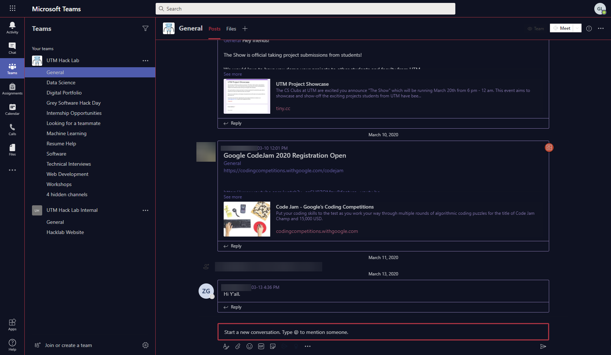

# Wal-Teams

A custom theme for Microsoft Teams:tm: that is designed to hook into [PyWal](https://github.com/dylanaraps/pywal)

Note: This theme is a work in progress and does not have full coverage

## Screenshot

> Names and images blurred for privacy

## Usage

1. Either modify the provided `colors.scss` file or use one generated by PyWal
2. Use a SASS compiler to generate the CSS file
3. Install [Stylus](https://github.com/openstyles/stylus)
4. Add the CSS file as a theme for `teams.microsoft.com`
5. Open Teams in your browser
  5.1 Recommendation: [Open Chrome in "App Mode"](https://superuser.com/questions/33548/starting-google-chrome-in-application-mode) for an experience very similar to the electron app